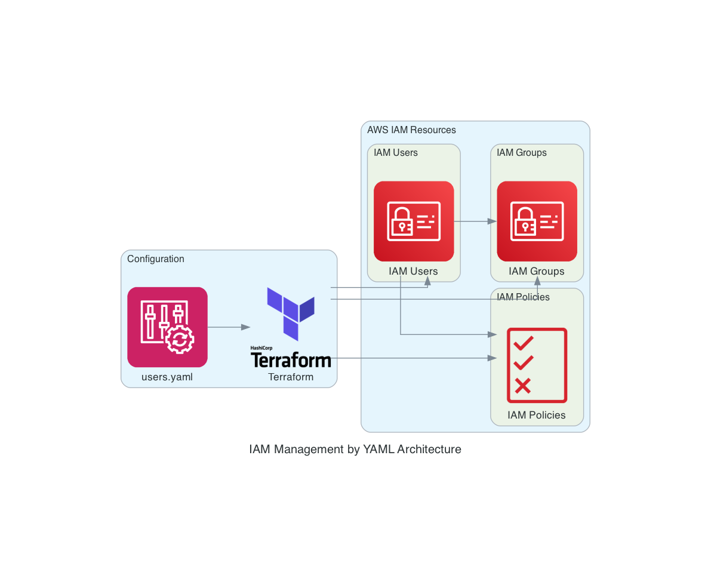

# IAM Management by YAML Project

This project provides an automated way to manage AWS IAM users, groups, and policy attachments using Terraform with YAML-based configuration.

## Overview

The IAM Management by YAML project allows you to define AWS IAM users, their group memberships, and policy attachments in a simple YAML file. Terraform then processes this configuration to create and manage the IAM resources in your AWS account.

## Architecture



The project follows a simple workflow:
1. Define users, roles, and groups in `users.yaml`
2. Terraform reads the YAML file and creates the necessary AWS resources
3. IAM users, groups, and policy attachments are managed automatically

## Project Structure

- `main.tf` - Contains the Terraform resources for IAM users, groups, and policy attachments
- `providers.tf` - AWS provider configuration and local variables for processing YAML data
- `users.yaml` - YAML configuration file defining users, their roles, and group memberships
- `architecture_diagram.py` - Python script to generate the architecture diagram

## Features

- Define IAM users with their associated roles and groups in a simple YAML format
- Automatic creation of IAM users with secure passwords
- Group management for organizing users
- Policy attachment based on predefined AWS managed policies
- Easily extensible for additional IAM resources

## Prerequisites

- Terraform v1.0+
- AWS CLI configured with appropriate credentials
- Python 3.6+ with diagrams package (for generating architecture diagrams)

## Usage

1. Define your users in the `users.yaml` file:
```yaml
users:
  - username: UserName
    roles: [AmazonEC2FullAccess, AmazonS3FullAccess]
    group: GroupName
```

2. Initialize Terraform:
```bash
terraform init
```

3. Apply the configuration:
```bash
terraform apply
```

4. To generate the architecture diagram:
```bash
python architecture_diagram.py
```

## Security Considerations

- Passwords are generated securely but should be changed on first login
- Follow the principle of least privilege when assigning IAM policies
- Consider using AWS Organizations and Service Control Policies for additional security layers

## License

[Specify your license here]
